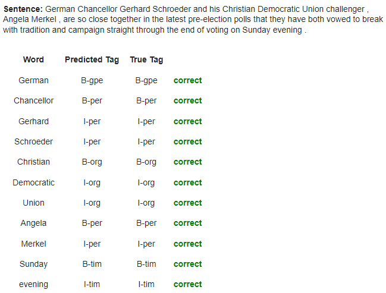
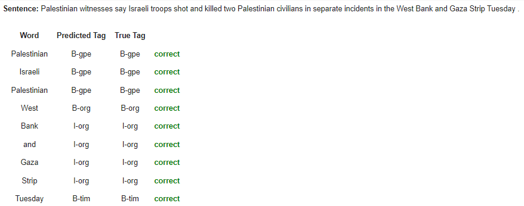
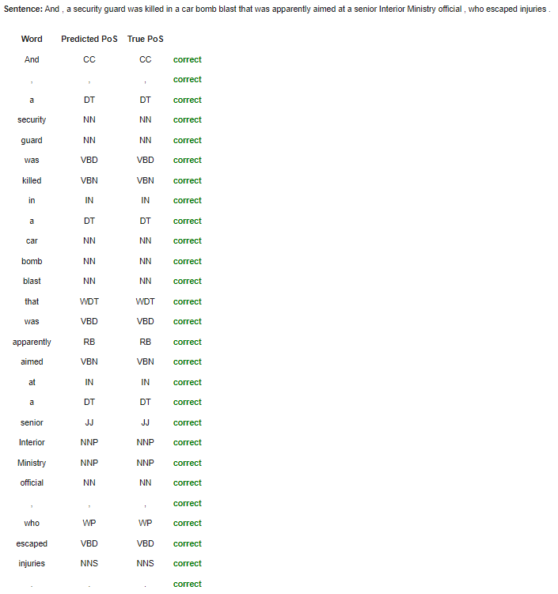
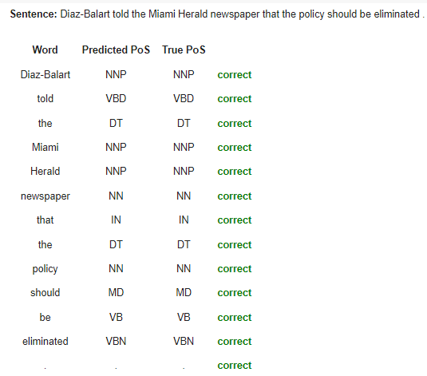

# <h1 align="center">**Token Classification**</h1>

 

This repository implements Token Classification models, a Natural Language Processing (NLP) task that assigns labels to individual tokens in a sentence. These models are built using TensorFlow and the Hugging Face Transformers library. The architectures are based on [LSTM](https://www.tensorflow.org/api_docs/python/tf/keras/layers/LSTM) networks and the pretrained [BERT](https://huggingface.co/docs/transformers/model_doc/bert) model.

Key applications of token classification include Named Entity Recognition (NER) and Part-of-Speech (PoS) tagging. In real-world scenarios, these tasks are crucial for various applications such as information extraction, text analysis, and language understanding.

## **Use Cases So Far:**

- **Named Entity Recognition:** This model identifies and classifies named entities in a text, such as names of persons, dates, locations, organizations, etc. It has been trained using the [NER dataset from Kaggle](https://www.kaggle.com/datasets/namanj27/ner-dataset), which provides 17 different labels for this task.

- **Part-of-Speech Tagging:** This model recognizes and tags parts of speech, such as nouns, pronouns, adjectives, or verbs, in a given text. It has been trained using a dataset containing 42 labels specifically for this task, also sourced from Kaggle.

## **Some Results of the Predictions**

- **Named Entity Recognition**

 

---

 

- **Part-of-Speech Tagging**

 

---

 

#### *Further results from the predictions can be found in their respective notebooks.*

## **Technological Stack**
 

## **Contact**

